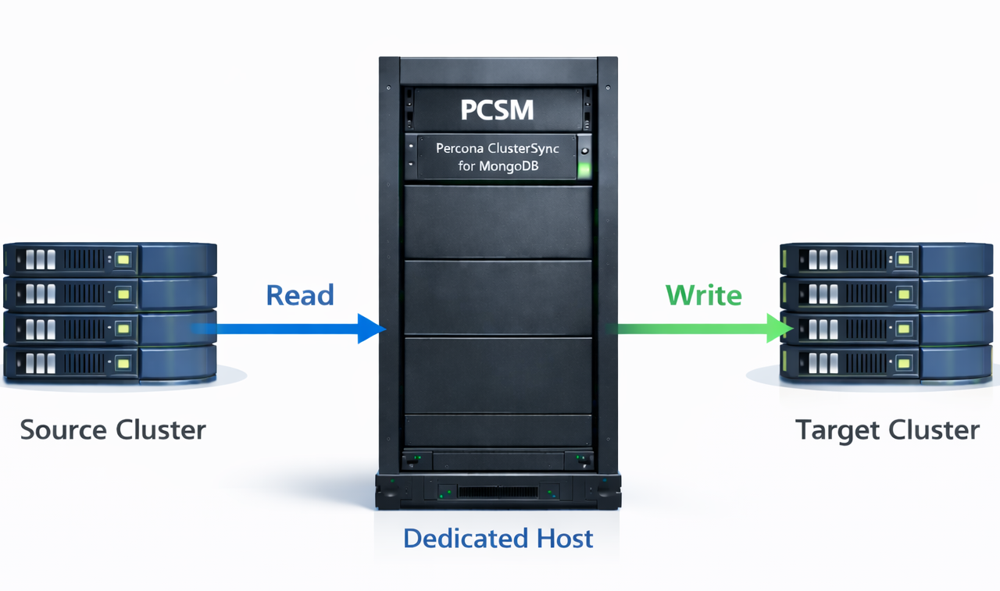

# {{plm.full_name}} deployment architecture

Percona ClusterSync for MongoDB (PCSM) is a middleware synchronization tool that connects source and target clusters. It reads change streams from the source cluster and applies those changes to the target cluster. 

Since PCSM operates as a standalone binary process, its placement within your infrastructure can significantly impact performance, especially regarding network latency, which can affect replication time. 

You can deploy PCSM using one of three different architectures.

## Dedicated host (intermediary)

The PCSM process runs on a dedicated machine, which can be a virtual machine, container, or physical server. This machine is logically placed between the source and target clusters. Since data migration is resource-intensive, its recommended to install PCSM as close to the target cluster as possible to reduce network latency.

!!! info "Recommended deployment"
    This deployment architecture is recommended for Production as it is the most robust and safe architecture for critical data synchronization.

| Pros | Cons |
|------|------|
| **Resource isolation**: PCSM has its own dedicated CPU and RAM, ensuring it does not **starve** the source or target databases.| **Network latency**: Adds an extra network hop (Source → PCSM → Target), introducing some latency, which is typically negligible in modern, low-latency networks. |
| **Stability**: In the event that PCSM crashes or becomes unresponsive, both the source and target clusters will remain completely unaffected.| **Infrastructure cost**: Requires provisioning and maintaining an additional compute resource for the PCSM service. |
| **Scalability**: The PCSM host can be vertically scaled (for example, adding memory for large in-memory buffers) without modifying database hardware. |  |

## Target node (Co-located)

The PCSM process runs directly on a primary node in the target cluster.

!!! info "Recommended deployment"
    This deployment architecture is recommended for **one-way migrations** where the target cluster is currently empty and not serving application traffic.

| Pros | Cons |
|------|------|
| **Efficient writes:**  Write operations are performed directly on the target, which helps to minimize write latency.
 |Vertical scalability impacts the database. |
| **Safer for Production:**: Resource contention, such as CPU and RAM spikes, affects the target cluster while leaving the production source cluster unaffected.|

## Source node deployment (Co-located)

The PCSM process executes directly on a primary node in the source cluster.

!!! warning "Recommended deployment: Use with caution"
    This deployment architecture is recommended only for low-traffic source clusters or when the source node has significant available capacity.

| Pros | Cons |
|------|------|
| **Lowest read latency**: PCSM reads the local changes directly from the filesystem or local loopback network, minimizing read overhead.| **Resource Contention**: PCSM competes with the running source database for CPU, RAM, and Network I/O. During heavy sync phases (initial sync), this can degrade the performance of the production source cluster. |
| **Simplicity**: No need to provision extra hardware.| **Failure Risk**: If PCSM consumes excessive memory or causes an OS-level fault, it could bring down the source node.|