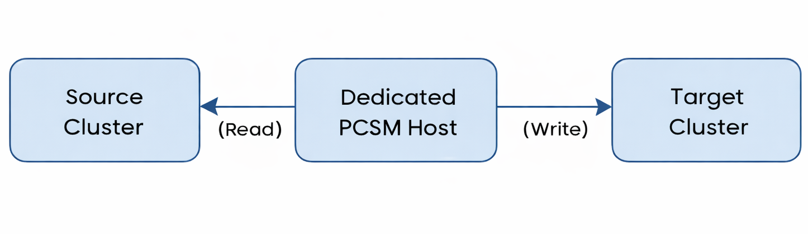
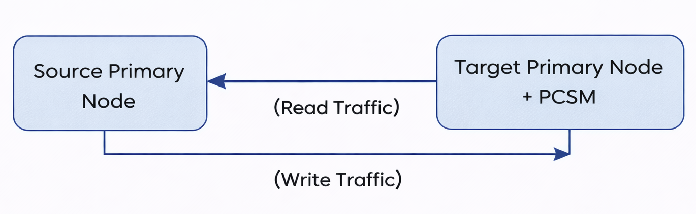
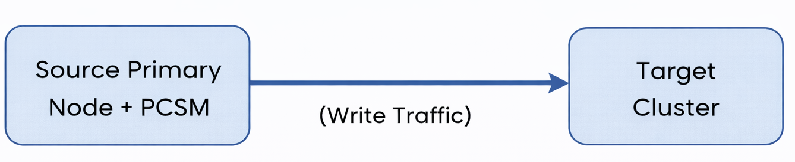

# Deployment architecture

Percona ClusterSync for MongoDB (PCSM) is a middleware synchronization tool that connects source and target clusters. It reads the change stream from the source cluster and applies those changes to the target cluster. 

!!! info "Important"
    - The target replica set does **not** need to be entirely empty. PCSM operates at the **collection level**:
   - Only the **target collections selected for synchronization** are affected and will be **overwritten**.
   - Any **other databases or collections** on the target cluster that are **not** part of the sync selection remain **intact**.

For comprehansive information on how {{pcsm.full_name}} works, see [Replication workflows](intro.md#replication-workflows##__tabbed_1_1).

This same overwrite behavior also applies to relevant **create collection** events received during replication: when a replicated collection is created (or detected) on the source, PCSM will create it on the target using the source definition, overwriting the target collection if it already exists.

Since PCSM operates as a standalone binary process, its placement within your infrastructure can significantly impact performance, particularly in terms of network latency, which can affect replication time. 

You can deploy PCSM using one of three different architectures.

## Dedicated host (intermediary)

The PCSM process runs on a dedicated machine, which can be a virtual machine, container, or physical server. This machine is logically placed between the source and target clusters. Since data migration is resource-intensive, it is recommended to install PCSM as close to the target cluster as possible to reduce network latency.

!!! info "Recommended use"
    This deployment architecture is recommended for production environments as it provides the highest level of isolation and reliability for critical data synchronization.

| Pros | Cons |
|------|------|
| **Resource isolation**: PCSM has its own dedicated CPU and RAM, ensuring it does not **starve** the source or target databases.| **Network latency**: Adds an extra network hop (Source → PCSM → Target), introducing some latency, which is typically negligible in modern, low-latency networks. |
| **Stability**: In the event that PCSM crashes or becomes unresponsive, both the source and target clusters will remain completely unaffected.| **Infrastructure cost**: Requires provisioning and maintaining an additional compute resource for the PCSM service. |
| **Scalability**: The PCSM host can be vertically scaled (for example, adding memory for large in-memory buffers) without modifying database hardware. |  |

## Target node (co-located)

The PCSM process runs directly on a primary node in the target cluster.

!!! info "Recommended use"
    This deployment architecture is recommended for **one-way migrations** where the target cluster is currently empty and not serving application traffic.

| Pros | Cons |
|------|------|
| **Efficient writes:**  Write operations are performed directly on the target, which helps to minimize write latency. | **Limited vertical scalability**: Scaling PCSM on this co-located node requires scaling the entire database server (CPU, RAM, and I/O), which can be unnecessary and costly and may increase resource contention with the target database. |
| **Minimizes impact on the production source cluster:** Resource contention, such as CPU and RAM spikes, affects the target cluster while leaving the production source cluster unaffected.|

## Source node deployment (co-located)

The PCSM process executes directly on a primary node in the source cluster.

!!! warning "Recommended use"
    This deployment architecture is recommended only for low-traffic source clusters or when the source node has significant available capacity.

| Pros | Cons |
|------|------|
| **Lowest read latency**: PCSM directly reads local changes from the filesystem or loopback network, which minimizes read overhead.| **Resource contention**: PCSM competes with the running source database for CPU, RAM, and network I/O resources. During heavy synchronization phases, such as the initial sync, this competition can degrade the performance of the production source cluster.|
| **Simplicity**: There is no need to provision extra hardware.| **Failure Risk**: If PCSM uses too much memory or causes an Operation system level fault, it may crash the source node.|

## Choosing the right deployment architecture

| Deployment model | Recommended for                         | Risk level |
| ---------------- | --------------------------------------- | ---------- |
| Dedicated host   | Production workloads and large datasets | Low        |
| Target node      | One-way migrations to idle targets      | Medium     |
| Source node      | Low-traffic or non-critical sources     | High       |

## Use cases

=== ":material-server: Dedicated host"
    You can use the dedicated host (intermediary) architecture in the following scenarios:

    - When migrating production data where stability, isolation, and predictable performance are critical.

    - Suitable for clusters with large data sizes or sustained high write throughput, where PCSM requires significant CPU and memory resources.

    - When neither the source nor the target database nodes can tolerate additional CPU, memory, or I/O load from replication processes.

=== ":material-database-arrow-right: Target node (co-located)"
    You can use the target node (co-located) deployment in the following scenarios:

    - When migrating data into a newly provisioned target cluster that is not serving application traffic yet.

    - Useful when the target cluster is used for validation, testing, or acceptance before being promoted to production.

    - Appropriate when minimizing write latency on the target cluster is more important than isolating replication workloads.

=== ":material-database-arrow-left: Source node (co-located)"
    You can use the source node (co-located) deployment in the following scenarios:

    - When the source cluster handles minimal application traffic and has sufficient spare CPU, memory, and I/O capacity to accommodate PCSM without performance degradation.

    - Suitable for non-production environments where temporary performance impact on the source cluster is acceptable.

    - Useful when provisioning additional compute resources (such as a dedicated PCSM host) is not possible.