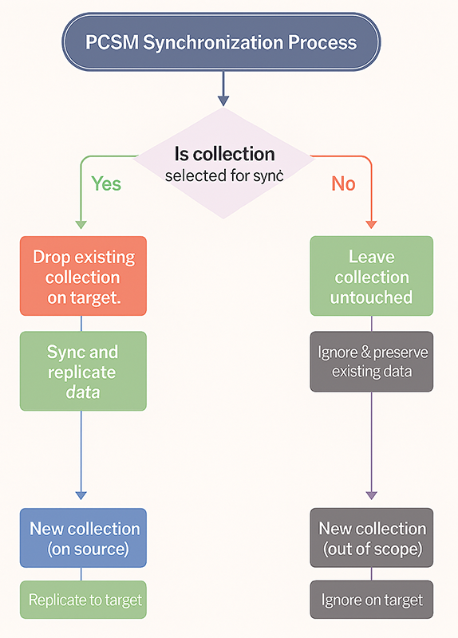

# Use {{pcsm.full_name}}

{{pcsm.full_name}} doesn't automatically start data replication after startup. It has the `idle` status indicating that it is ready to accept requests.

!!! tip "Understanding the workflow"

    For an overview of how {{pcsm.short}} works and the replication workflow stages, see [How {{pcsm.full_name}} works](../intro.md).

You can interact with {{pcsm.full_name}} using the command-line interface or via the HTTP API. Read more about [{{pcsm.short}} HTTP API](../api.md).

## Before you start

PCSM operates at the collection level rather than the replica set level. The target collections on the Percona Server for MongoDB replica set will be overwritten.

- **Scope of Synchronization**: PCSM affects only the collections explicitly selected for synchronization.
    - If a selected collection already exists on the target, PCSM drops that collection before starting the initial sync to ensure data consistency.
    - Collections on the target that are not included in the replication scope remain untouched.

- **Handling New Collections**: During replication, PCSM creates or modifies only collections explicitly selected for synchronization.
    - Newly created collections on the source are replicated to the target only if they fall within the defined synchronization scope.
    - Collections outside the scope are ignored.



## Start the replication

Start the replication process between source and target clusters. {{pcsm.short}} starts copying the data from the source to the target. First it does the initial sync by cloning the data and then applying all the changes that happened since the clone start. 

Then it uses [change streams :octicons-link-external-16:](https://www.mongodb.com/docs/manual/changeStreams/) to track changes on the source and replicate them to the target.

=== "Command line"

    ```{.bash data-prompt="$"}
    $ pcsm start
    ```

    ??? example "Expected output"

        ```{.json .no-copy}
        {
          "ok": true
        }
        ```

=== "HTTP API"
    
    Send a POST request to the `/start` endpoint:

    ```{.bash data-prompt="$"}
    $ curl -X POST http://localhost:2242/start 

    ```

## Start the filtered replication

You can replicate the whole dataset or specific namespaces - databases and collections. You can specify what namespaces to include and/or exclude from the replication. 

To include or exclude a specific database and all collections it includes, pass it in the format `mydb.*`.

When both include and exclude filters are used, the exclude filter takes precedence. For instance, if you include all collections in the `mydb` database but exclude `mydb.users`, PCSM will replicate all collections from `mydb` **except** `mydb.users`.

=== "Command line"

    ```{.bash data-prompt="$"}
    $ pcsm start \ 
    --include-namespaces="db1.collection1,db2.collection2" \
    --exclude-namespaces="db3.collection3"
    ```

    ??? example "Expected output"

        ```{.json .no-copy}
        {
          "ok": true
        }
        ```

=== "HTTP API"
    
    Send a POST request to the `/start` endpoint:

    ```{.bash data-prompt="$"}
    $ curl -X POST http://localhost:2242/start -d '{
        "includeNamespaces": ["db1.collection1", "db2.collection2"],
        "excludeNamespaces": ["db3.collection3"]
    }'
    ```

## Pause the replication

You can pause the replication at any moment. {{pcsm.short}} stops the replication, saves the timestamp, and enters the `paused` state. {{pcsm.short}} uses the saved timestamp after you [resume the replication](#resume-the-replication).

=== "Command line"

    ```{.bash data-prompt="$"}
    $ pcsm pause
    ```

=== "HTTP API"

    Send a POST request to the `/pause` endpoint:

    ```{.bash data-prompt="$"}
    $ curl -X POST http://localhost:2242/pause
    ```

## Resume the replication

Resume the replication. {{pcsm.short}} changes the state to `running` and copies the changes that occurred from the timestamp it saved when you paused the replication. Then it continues monitoring data changes and replicating them in real time. 

=== "Command line"

    ```{.bash data-prompt="$"}
    $ pcsm resume
    ```

=== "HTTP API"

    Send a POST request to the `/resume` endpoint:

    ```{.bash data-prompt="$"}
    $ curl -X POST http://localhost:2242/resume
    ```

The replication may fail for some reason, like lost connectivity or the like. In this case you can resume replication by adding the `--from-failure` flag to the `resume` command:

=== "Command line"

    ```{.bash data-prompt="$"}
    $ pcsm resume --from-failure
    ```

=== "HTTP API"

    Send a POST request to the `/resume` endpoint:

    ```{.bash data-prompt="$"}
    $ curl -X POST http://localhost:2242/resume -d '{
        "fromFailure": true
    }'
    ```


## Check the replication status

Check the current status of the replication process.

=== "Command line"

    ```{.bash data-prompt="$"}
    $ pcsm status
    ```

=== "HTTP API"

    Send a GET request to the `/status` endpoint:

    ```{.bash data-prompt="$"}
    $ curl http://localhost:2242/status
    ```

## Finalize the replication

When you no longer need / want to replicate data, finalize the replication. {{pcsm.short}} stops replication, creates the required indexes on the target, and stops. This is a one-time operation. You cannot restart the replication after you finalized it. If you run the `start` command, {{pcsm.short}} will start the replication anew, with the initial sync. 

=== "Command line"

    ```{.bash data-prompt="$"}
    $ pcsm finalize
    ```

=== "HTTP API"
    
    Send a POST request to the `/finalize` endpoint:

    ```{.bash data-prompt="$"}
    $ curl -X POST http://localhost:2242/finalize
    ```
